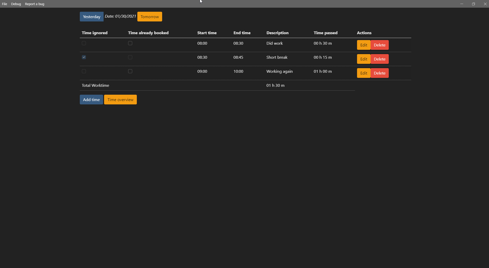
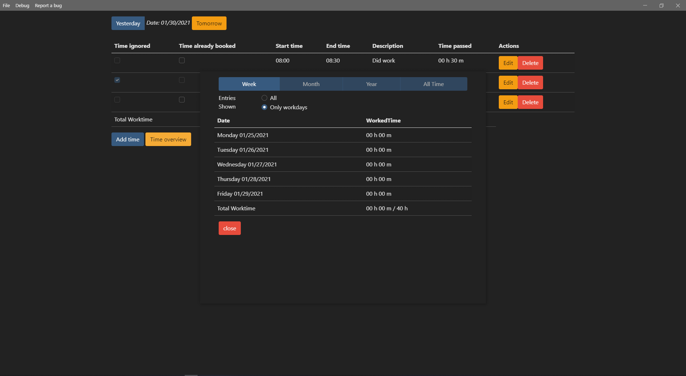

# Time booking

- [Time booking](#time-booking)
  - [Installation](#installation)
    - [Updating](#updating)
  - [Contributing](#contributing)
  - [Light or Dark?](#light-or-dark)
  - [License](#license)

This application is based on [electron] a Chromium based cross platform framework. Those apps are written with html and javascript. The application will enable you to book your time.

The data is stored locally only it is not possibly to move the bookings to another system right now.

## Installation

On each build there are installer for the following systems

* Windows 32/64 bit
* MacOs 
* Linux (deb)

Those installer should allow you to install the application as usually. Please keep in mind that only the windows installers are tested, if you detect any problems with the installation please create a new [issue] on this repository. You can find the installers on the [release][releases] page.

### Updating

Right now there is no possibility to update the application automatically you will need to GitHub [release][releases] page for new versions.

## Contributing

If you want to help out on the project please read the [contributing file][contributing].

## Light or Dark?

The application tries to choose the theme based on the settings of your operation system. There is a light and a dark theme

## License
You can view the license for thi project [here][license].

[electron]: https://www.electronjs.org/
[releases]: https://github.com/XanatosX/TimeBooking/releases
[issue]: https://github.com/XanatosX/TimeBooking/issues
[license]: ./LICENSE
[contributing]: ./CONTRIBUTING.md
